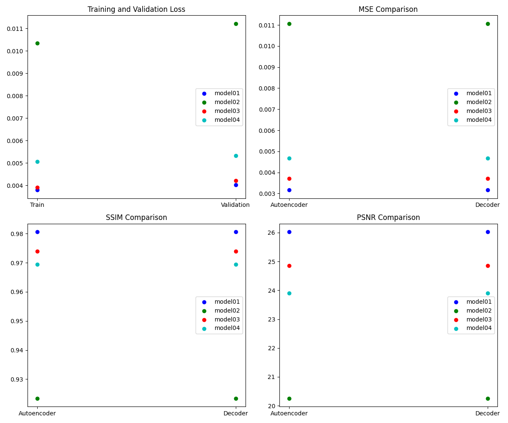
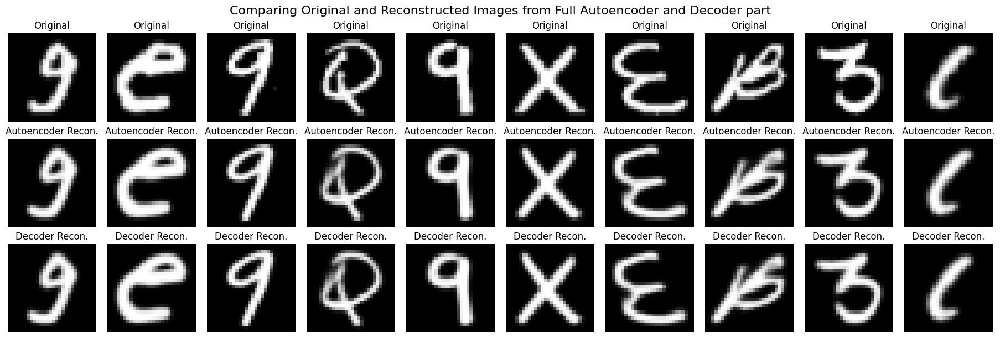
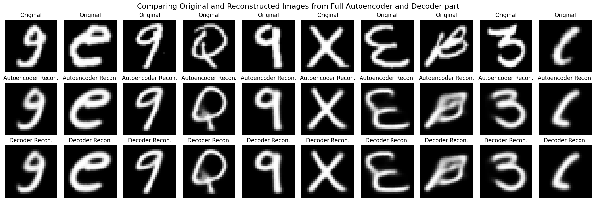
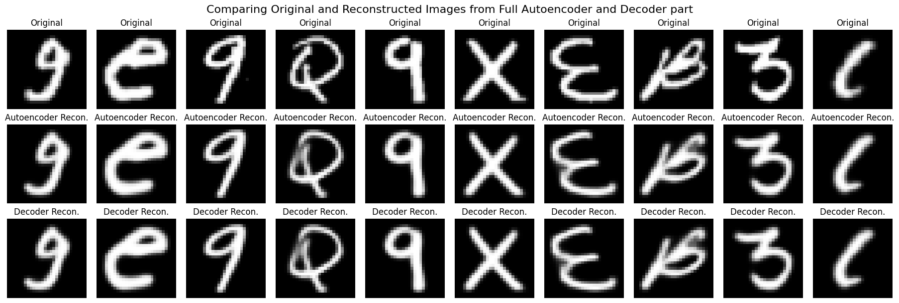
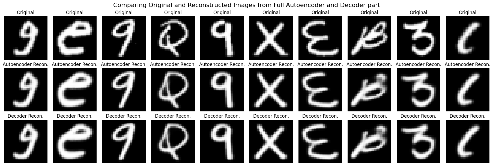

# EMNIST-DataCompressNet

  

## Project Overview: Data Compression with Complex Autoencoder Architectures

The primary objective of this project is to develop an efficient model for data compression. The focus is on leveraging complex autoencoder architectures to achieve significant dimensionality reduction while minimizing information loss. These models are adept at encoding high-dimensional data into a lower-dimensional space, effectively compressing the data while preserving its essential characteristics. 
This approach aims to reduce the memory footprint of data, which is crucial in various applications, including storage optimization and efficient data transmission. It's important to note that this form of compression primarily pertains to reducing dimensionality and memory usage, rather than decreasing storage size.

## Autoencoder Architecture and Applications

  

*By Michela Massi - Own work, CC BY-SA 4.0, https://commons.wikimedia.org/w/index.php?curid=80177333*

Autoencoders are a type of neural network architecture used for unsupervised learning. They are designed to encode input data into a lower-dimensional representation and then reconstruct the original data from this representation. This process allows for learning efficient data codings in an automated fashion.

### Applications of Autoencoders:
- **Data Compression:** In the context of data compression, autoencoders excel at representing data in a more compact form, which helps in reducing memory usage without significantly compromising the data's integrity.
- **Dimensionality Reduction:** Autoencoders can reduce the dimensionality of data, similar to Principal Component Analysis (PCA), making them useful for data visualization and noise reduction.
- **Feature Learning, Image Reconstruction, and Generative Models:** They are also used for automated feature learning, image reconstruction tasks like denoising and inpainting, and as generative models for creating new data instances.

### Design Choices for Encoder and Decoder:
For high-quality image reconstruction, I made specific design choices in the encoder and decoder parts of the autoencoder:

#### Encoder - I opted for `Conv2D` layers with strides instead of `MaxPooling2D` to:

- **Preservation of Spatial Information:** By using only `Conv2D` layers with strides for downsampling, I aimed to preserve more spatial information compared to max pooling. Strided convolutions reduce dimensions while learning how to downsample, retaining more details that are crucial for accurate reconstruction.
- **Balancing Efficiency and Detail:** I avoided `MaxPooling2D` to minimize information loss and ensure that the encoded representation retains sufficient detail for high-quality reconstruction.

#### Decoder - Conv2DTranspose over UpSampling:
- **Quality of Reconstruction:** To reconstruct the images from the latent representation, I chose `Conv2DTranspose` layers over `UpSampling2D`. This decision was driven by the need for higher-quality image reconstruction.
- **Learnable Upsampling:** `Conv2DTranspose` layers offer learnable parameters for upsampling, allowing the network to effectively learn how to expand the encoded representation back to the original image size.
- **Avoiding Artifacts:** The use of `Conv2DTranspose` also helps in reducing artifacts that might occur with simpler upsampling methods.

### Experimental Approach:
To determine the optimal layer configuration for the decoder, I tested four different models, each with a unique decoder structure. The performance of each model was assessed based on several key metrics. This evaluation was conducted for both the full autoencoder models and only their decoder parts, to gauge their respective abilities in reconstructing images accurately.
This systematic exploration helps us understand the impact of decoder configurations on image reconstruction quality, providing insights for enhancing autoencoder performance in data compression tasks. 

### Dataset Used:
For this analysis, the **EMNIST-Balanced** dataset was chosen. It is a comprehensive dataset that includes a mix of digits, uppercase, and lowercase letters, offering a diverse range of characters for my models to learn and reconstruct.
*https://github.com/machinecurve/extra_keras_datasets*

- Below is a detailed analysis including explanations of each metric:

### Metrics Explained:
- **Training Loss:** Measures how well the model is performing during the training phase. Lower values indicate better performance.
- **Validation Loss:** Indicates the model's performance on unseen data. It helps to identify overfitting.
- **Mean Squared Error (MSE):** Quantifies the average squared difference between the reconstructed and original images. Lower MSE values signify more accurate reconstructions.
- **Structural Similarity Index (SSIM):** Assesses the perceived quality of the reconstructed image compared to the original. Ranges from -1 to 1, with higher values indicating better image quality.
- **Peak Signal-to-Noise Ratio (PSNR):** Measures the ratio between the maximum possible power of a signal and the power of corrupting noise. Expressed in decibels (dB), higher values represent better reconstruction quality.

  

- **Model01** demonstrates the best overall performance with the lowest training and validation loss, indicating excellent generalization. It also achieved the highest SSIM, reflecting superior image reconstruction quality.

  

- **Model02** shows a higher training and validation loss, suggesting potential overfitting. The lower SSIM and PSNR indicate a comparatively reduced ability in preserving image details during reconstruction.

  

- **Model03** offers a good balance between training and validation performance. It shows a high degree of image reconstruction accuracy, as evident from its SSIM and PSNR values.

  

- **Model04** falls between Models01 and 02 in terms of performance metrics. It displays a moderate level of image reconstruction capability, reflected in its SSIM and PSNR scores.

  

### Summary
The evaluation metrics indicate that **Model01** stands out as the most effective in reconstructing images from the EMNIST-Balanced dataset, with the highest SSIM and PSNR scores and the lowest loss values. **Models03** and **04** offer competitive performance, with **Model02** lagging slightly behind in terms of image quality preservation. These insights are crucial for further refinement of autoencoder models for image reconstruction tasks.

### Concluding Remarks
This investigation, forming a part of a broader exploration into data compression using various architectures, focuses specifically on the use of complex autoencoder structures. While simpler architectures could be employed, they typically result in greater information loss. My goal is to discover an architecture that not only compresses data but also does so in a near-lossless manner. The complex architecture of the autoencoders in this study was chosen to minimize information loss while achieving data compression.
The ability of these models to reconstruct images serves as a testament to their potential for lossless data reuse. Moreover, the trained models have been saved and can be reused or fine-tuned for datasets with similar distributions, further enhancing their utility.

## Acknowledgments

- A special thank you to **Dr. Peter Steinbach**, Team Lead for Matter Research at Helmholtz AI Consultants, for his smart proposal regarding the topic of data compression using encoders. You can find more about his works on [Peter Steinbach](https://github.com/psteinb).
- Data provided by [MachineCurve](https://github.com/machinecurve/extra_keras_datasets).

## Contact for Collaboration
- If you are interested in collaborating or have ideas to share, please feel free to reach out to me at [habibi.physics@gmail.com](mailto:habibi.physics@gmail.com). 

